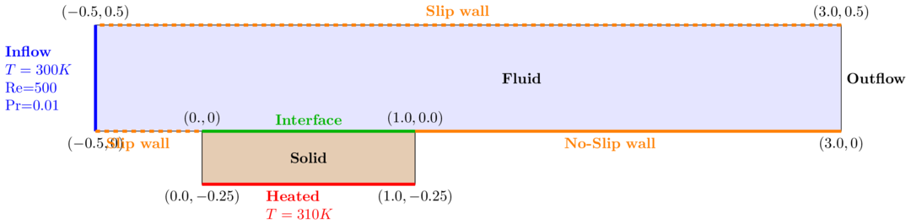

# Conjugate heat transfer

Last updated: 2019-04-16

**NOTE**: The description below refers to the preCICE-OpenFOAM test case. Our current setting is motivated by that test case, but has some differences.

**TODO**: Write down information about our current test case.

## Short description 

The test case descibes fluid flow in a square channel connected to a solid, square block. The square block is heate from below and connected from to the channel. The block is cooled by the fluid at the top. This means that the fluid is heated up accordingly and the temperature changes.

Further description can be on the `preCICE` homepage:

1. Using `OpenFOAM`+`OpenFOAM`[https://github.com/precice/openfoam-adapter/wiki/Tutorial-for-CHT:-Flow-over-a-heated-plate](https://github.com/precice/openfoam-adapter/wiki/Tutorial-for-CHT:-Flow-over-a-heated-plate)
1. Using `OpenFOAM` adapter + `FEniCS` [https://github.com/precice/precice/wiki/Tutorial-for-CHT:-Flow-over-a-heated-plate-with-OpenFOAM-and-FEniCS](https://github.com/precice/precice/wiki/Tutorial-for-CHT:-Flow-over-a-heated-plate-with-OpenFOAM-and-FEniCS)

The test case is based on

[1]: M.Vynnycky, S.Kimura, K.Kanev, I.Pop: "Forced convection heat transfer from a flat plate: the conjugate problem", [https://www.sciencedirect.com/science/article/pii/S0017931097001130](https://www.sciencedirect.com/science/article/pii/S0017931097001130)

## Geometry

Image of geometry:

### Generic geometry description

The solid block has length L and its height b varies depending on the sources I see. 

In the tutorial (only `OpenFOAM` sovlers) the following values are used

- L = 1
- b = L/4 = 0.25 (height of block)
- l = 3.5 * L = 3.5 (length of channel)
- h = L / 2 = 0.5 (height of channel)

The coordinates as used in the tutorials are given in the attached image `heat_transfer_channel.png` (Look into the tex file `heat_transfer_channel.tex`). 

**Note** (Alex): The description of the geometry is a bit misleading sometimes. The current coordinates are taken from the OpenFOAM setup that is distributed with the OpenFOAM adapter.

### Boundary conditions

**Note** (Alex): I just checked the OpenFOAM test case and it seems that we have slip wall boundaries almost everywhere. 

- Slip wall: Bottom left of channel (in front of interface) and top of channel
- No-slip wall: Bottom of channel after interface
- Inflow: Left of channel
- Outflow: right of channel
- Heats: Bottom of solid
- No-slip + temperature: Interface. They use a mix of Neumann (heat flux) and Dirichlet (temperature) boundary conditions in the solvers, if I understand them correctly.
                                                    
## Test case description

Reynolds number is Re=500 and Prandtl number is Pr=0.01. The ratio between solid and fluid conductivity is k = k_s/k_f = 1. 

| Parameter | value |
| --------- | ----- |
| Re        | 500   |
| Pr        | 0.01  |
| k         | 1     |

Dimensional parametes from Lucia's thesis:

| Parameter | Symbol | Value |
| --------- | ------ | ----- |
| Inlet velocity | U_infty | 0.1 | 
| Plate length | L | 1| 
| Solid thermal conductivity | k_s | 100 |
| Solid specific heat capacity | c_ps | 100 |
| Solid density | rho_s | 1 |
| Fluid thermal conductivity | k_f | = k_s / k |
| Fluid density | rho_f | 1 |
| Dynamic viscosity | mu | = rho_f * U_infty * L / Re |
| Fluid specific heat capacity | c_pf | = k_f Pr / mu |

**Note**: There is a [master's thesis by Lucia Cheung Yau](https://www5.in.tum.de/pub/Cheung2016_Thesis.pdf) in which she ran the simulation for a wider range of values.

### Flow solver
| Parameter | value |
| --------- | ----- |
| dt        |  0.01 |
| t_end     | 10    |

### Solid solver
| Parameter | value |
| --------- | ----- |
| dt        |  0.01 |
| t_end     | 10    |
 